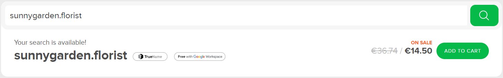
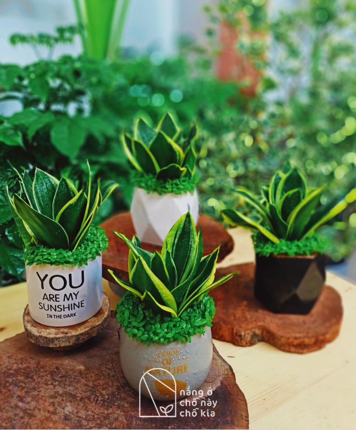

# webapp22-BuiDuc
This is a small project in B-TU for creating a web application
### Client

[Bui, Minh Duc](https://github.com/BMD91)

### Developer

[Polewska, Katarzyna Weronika](https://github.com/Polewska)

## Business description

### Domain
sunnygarden.florist

### Name
Sunny garden

### Location, contacts and business description
* Official name of business or shop: Sunny Garden.
* Address / physical presence: No. 78 Xa Dan street, Dong Da district, (10000) Hanoi, Vietnam.
* Contact information:
	+ Opening time: Monday - Saturday, 9:00 - 20:00
	+ E-mail: nangochonaychokia@gmail.com
	+ Phone numbers: +84 878211389
	+ Facebook: www.facebook.com/nangochonaychokia
* A brief portrait of customer's business: Selling and providing information about in-house trees and plants for all customers, especially for houses and apartments in crowded cities. The purpose of placing plants inhouse are:
	+ Decoration in room (living room, kitchen, bed room,...) or in a restaurants / cafe.
	+ Planting savories in a small place.
	+ Air filtration.

### Support from a web application
* Management of all plants in the shop.
* Management of all orders from customers, those who bought products of shop.

### List of management tasks
* Creating information of a plant / plants, which is new products of shop. Information should be: ID of plants, name, individual price (for a single unit) and suitable type of vase / pot.
* Retrieving data of plants as a list, which are currently in store of shop.
* Updating data of plants (name, price or suitable vase).
* Deleting whole data of a plant (because of selling out for example).

* Creating information of an order from a customer. It contains: customer ID, name of customer, plants they bought and total price of the order.
* Retrieving data of orders in a list.
* Updating information of an order by changing name of customer or changing name of products or changing price.
* Deleting data of an order, because it can be wrong or customer does not want to by products anymore.

* Creating data of vase / pot : vase id, size of vase and price.
* Retrieving list of vase.
